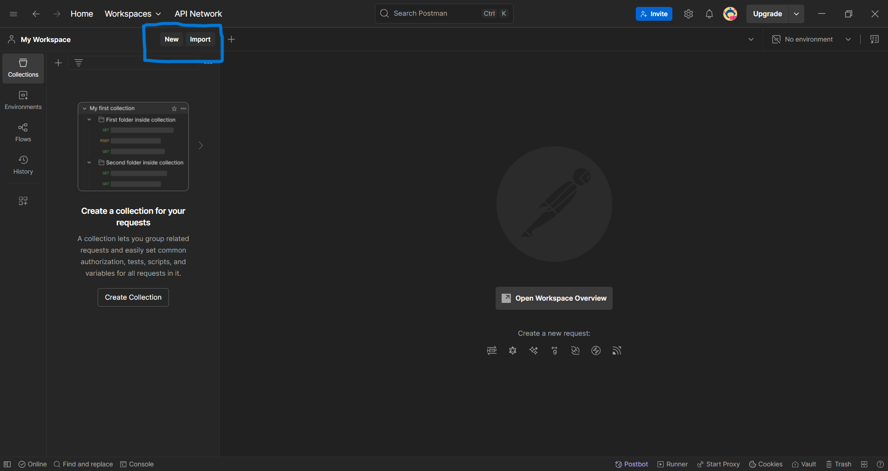
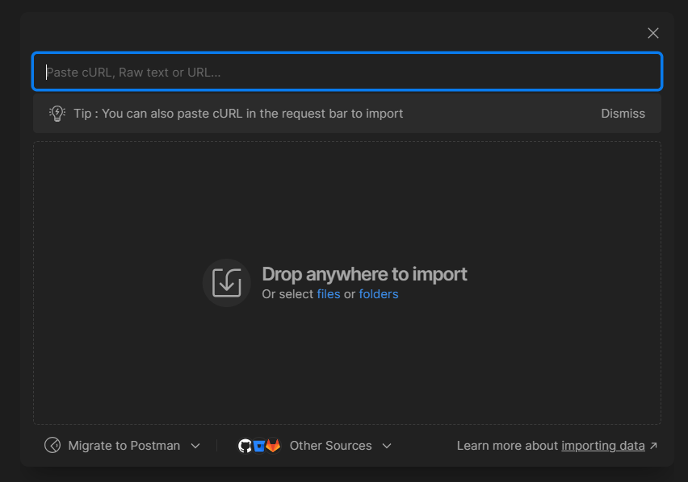

# Intuitive Care - API de Operadoras

Esta API permite buscar operadoras com base no nome. O Postman Collection fornece testes para validar diferentes cenários de entrada.

---

## Como Usar

1. **Importar a Coleção:**
    - Abra o Postman
    - Clique em Import > File > Selecione o arquivo JSON da coleção
        
    
    - Acesse a pasta postman/curl e selecione o arquivo
        
    
2. **Configurar o Servidor:**
    - A API deve estar rodando localmente em http://127.0.0.1:8000. 

3. **Executar os Testes:**
    - Cada requisição simula um cenário de busca. Para testar:
        - Selecione uma requisição
        - Clique em Send
        - Observe a resposta no painel inferior

---

## Requisições Disponíveis

1. **DEVE_RETORNAR_DADO**
    - Objetivo: Retorna informações da operadora quando o nome é digitado corretamente.
    - Exemplo: termo=18 DE JULHO ADMINISTRADORA DE BENEFÍCIOS LTDA

2. **DEVE_RETORNAR_DADO_PARAM_COM_ESPAÇO**
    - Objetivo: Testa se a API ignora espaços extras no início e no final do termo.
    - Exemplo: termo= 2B ODONTOLOGIA OPERADORA DE PLANOS ODONTOLÓGICOS LTDA 

3. **DEVE_OCORRER_ERRO_PARAM_INSUFICIENTE**
    - Objetivo: Retorna erro ao inserir um termo muito curto.
    - Exemplo: termo=1

4. **DEVE_OCORRER_ERRO_CAMPO_VAZIO**
    - Objetivo: Retorna erro ao enviar um campo vazio.
    - Exemplo: termo=

5. **DEVE_OCORRER_ERRO_EMPRESA_INEXISTENTE**
    - Objetivo: Retorna erro quando a operadora não existe no banco de dados.
    - Exemplo: termo=EMPRESA_INEXISTENTE

---

## Possíveis Respostas

| Nome do Teste                        | Método | URL                                                 | Parâmetro (termo)                                  | Esperado |
|--------------------------------------|--------|------------------------------------------------------|----------------------------------------------------|----------|
| DEVE_RETORNAR_DADO                   | GET    | http://127.0.0.1:8000/operadoras/?termo=...         | 18 DE JULHO ADMINISTRADORA DE BENEFÍCIOS LTDA      | Dados encontrados |
| DEVE_RETORNAR_DADO_PARAM_COM_ESPAÇO  | GET    | http://127.0.0.1:8000/operadoras/?termo=...         |  2B ODONTOLOGIA OPERADORA DE PLANOS ODONTOLÓGICOS LTDA  | Dados encontrados |
| DEVE_OCORRER_ERRO_PARAM_INSUFICIENTE | GET    | http://127.0.0.1:8000/operadoras/?termo=1           | 1                                                  | Erro: caracteres insuficientes |
| DEVE_OCORRER_ERRO_CAMPO_VAZIO        | GET    | http://127.0.0.1:8000/operadoras/?termo=            | (vazio)                                            | Erro: termo ausente |
| DEVE_OCORRER_ERRO_EMPRESA_INEXISTENTE| GET    | http://127.0.0.1:8000/operadoras/?termo=EMPRESA_INEXISTENTE | EMPRESA_INEXISTENTE                           | Erro: empresa não existe |
