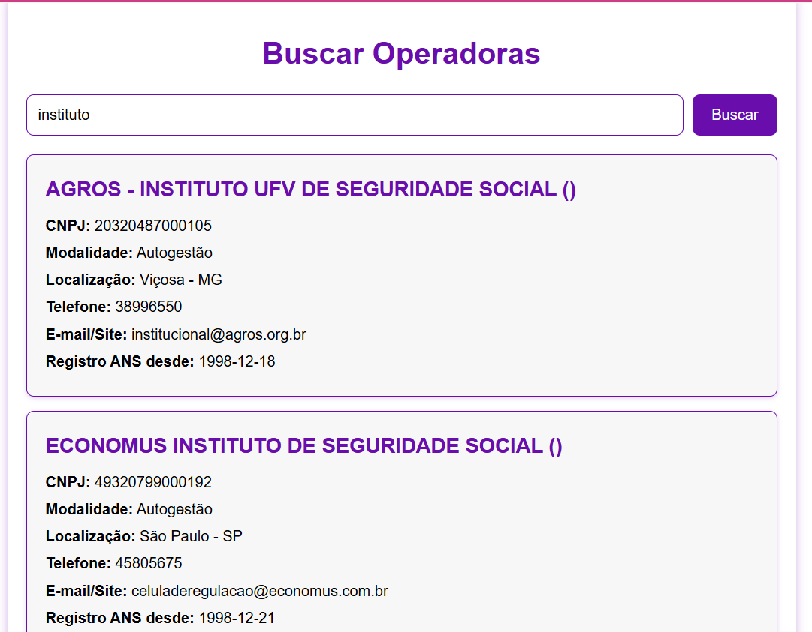
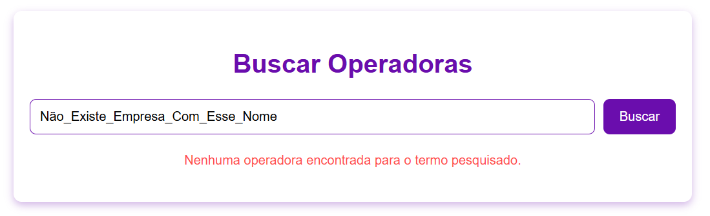
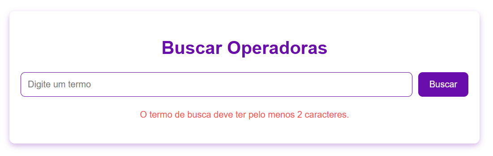

# Projeto Vue - Busca de Operadoras

Este projeto é uma aplicação frontend desenvolvida em **Vue.js** com **Vite**, que se comunica com um backend em **FastAPI**. A aplicação permite buscar operadoras de saúde por meio de um termo de pesquisa.

---

## 💡 Você pode testar a aplicação diretamente, sem rodar localmente, acessando: [Site](https://intuitive-vitor.vercel.app/)

### Exemplos para testar:

- ✅ Busca válida:
Tente digitar "instituto". O sistema retornará uma lista com as operadoras encontradas.
- ❌ Busca inválida:
Tente digitar "" ou algum termo aleatório como "Não_Existe_Empresa_Com_Esse_Nome". A aplicação irá exibir uma mensagem amigável indicando que nenhuma operadora foi encontrada ou o campo não pode ser vazio.

- 
- 
- 

---

## Funcionalidades

- O usuário pode buscar operadoras inserindo um termo na interface.
- O frontend realiza uma requisição **GET** para o backend.
- O backend retorna uma lista de operadoras correspondentes ao termo pesquisado.
- Os resultados incluem informações detalhadas sobre cada operadora, como **razão social, CNPJ, modalidade, localização, telefone, e-mail/site e data de registro na ANS**.

---

## Tecnologias Utilizadas

- **Frontend:** Vue.js 3.5.13, Vite
- **Backend:** [FastAPI](../api/README.md)
- **Node.js:** 22.14.0

---

## Como Rodar Localmente

### Rodar o Backend (FastAPI)

Antes de iniciar o frontend, é necessário que o backend esteja em execução.

### Rodar o Frontend (Vue + Vite)

1. **Navegue até a pasta do projeto frontend:**
   ```bash
   cd intuitiveFront
   ```
2. **Instale as dependências:**
   ```
   npm install
   ```
3. **Inicie o servidor de desenvolvimento:**
   ```
   npm run dev
   ```
4. **Acesse a aplicação no navegador:**
   ```
   http://localhost:5173
   ```

---

## Observações Importantes

- O **backend precisa estar rodando** para que o frontend funcione corretamente.
- O frontend faz requisições HTTP para buscar os dados das operadoras e exibi-los na interface.